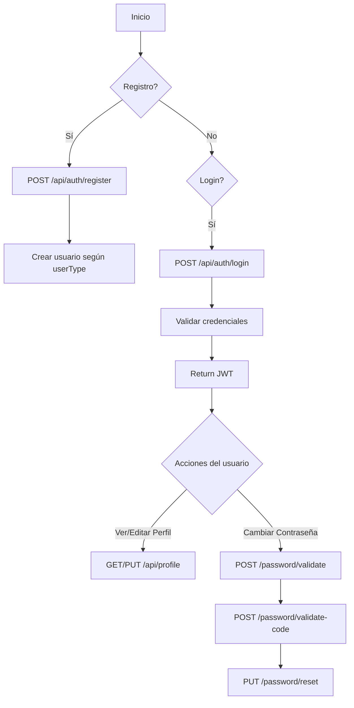

# Módulo de Autenticación

El módulo AUTH gestiona toda la parte de autenticación y autorización del sistema.
Incluye registro de usuarios, login, verificación de identidad, administración de perfiles, y seguridad basada en tokens JWT.

---

## 1. Registro de Usuario

### endpoint
```bash
POST api/auth/register
```
El tipo de usuario se especifica dentro del JSON:

### Cuerpo JSON según tipo de usuario
#### Cliente
```json
{
  "email": "cliente@correo.com",
  "password": "123456",
  "firstName": "Carlos",
  "lastName": "Ramírez",
  "phone": "3001234567",
  "userType": "CLIENTE"
}

```

#### Barbero(crea su cuenta, pero NO queda vinculado a ninguna barbería)
```json
{
  "email": "barbero@correo.com",
  "password": "123456",
  "firstName": "Luis",
  "lastName": "García",
  "phone": "3009876543",
  "userType": "BARBERO"
}
```
> Luego la barbería lo vincula usando:
```bash 
POST /api/barbershop/barber
```

#### Barbería
Debe enviar datos adicionales:
```json
{
  "email": "barberia@correo.com",
  "password": "123456",
  "firstName": "Juan",
  "lastName": "Pérez",
  "phone": "3015566777",
  "userType": "BARBERIA",
  "barberShop": {
    "name": "Barbería Elegante",
    "address": "Calle 123 #45-67",
    "phone": "3015566777"
  }
}

```
---

## 2. Inicio de sesión (Login)
### endpoint
```bash
POST api/auth/login
```

### respuesta
```json
{
  "token": "eyJhb..."
}
```

---

## 3. Seguridad (Spring Security + JWT)
- Autenticación mediante credenciales (email y contraseña).
- Generación de un JWT firmado manualmente con HS256.
- El token Expira en 24 horas.
- El token incluye los claims:
  - `sub:` correo del usuario autenticado.
  - `roles:` rol del usuario.
  - `passwordChangedAt:` fecha y hora del último cambio de contraseña.
  -  `iat y exp:` emisión y expiración.
  
Este claim `passwordChangedAt` permite revocar automáticamente tokens antiguos.

---

## 4. Gestión de Perfiles

|    Rol   |        Obtener Perfil       |      Actualizar Perfil      |
|:--------:|:---------------------------:|:---------------------------:|
| Cliente  | GET /api/client/profile     | PUT /api/client/profile     |
| Barbero  | GET /api/barber/profile     | PUT /api/barber/profile     |
| Barbería | GET /api/barbershop/profile | PUT /api/barbershop/profile |

Todos autenticados con JWT.

---

## 5. Recuperación de contraseña

Incluye 3 pasos:

#### Validar contraseña actual y enviar código al correo

- El usuario debe estar autenticado.
- Verificación de su contraseña actual.
- Si es correcta, se genera un código de 6 dígitos.
- Se envía por correo.
- Se guarda en PasswordResetToken con expiración.

#### Validar código

- Se busca el código.
- Se verifica si expiró.
- Si es válido, permite continuar.

#### Cambiar contraseña

- Se verifica nuevamente el código.
- Se actualiza la contraseña del usuario.
- Se actualiza lastPasswordChange.
- Se elimina el token temporal.
- Todos los JWT previos quedan invalidados.

#### Limpieza automática de tokens expirados

Un scheduler ejecutado periódicamente elimina automáticamente todos los tokens expirados de la base de datos, manteniendo limpia la tabla y evitando acumulación de registros innecesarios.

---

## 6. Validación personalizada del JWT
Se agregó un JwtDecoder personalizado con:

- Validaciones estándar.
- `PasswordChangedValidator.`

Este validador garantiza que un token anterior al último cambio de contraseña sea rechazado.

## 7. Diagrama de Flujo General – AUTH 



