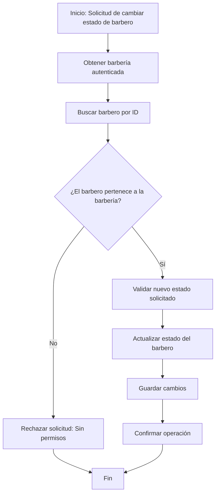

# Gestión de Estados de los Barberos

Este módulo permite que la barbería (usuario dueño) administre el estado de los barberos que pertenecen a su establecimiento.
Los barberos pueden tener los siguientes estados:

**ACTIVO:** Disponible para trabajar y recibir citas.

**INACTIVO:** Deshabilitado temporalmente por la barbería.

**VACACIONES:** No disponible durante un periodo determinado.

## Control de Acceso

Solo la barbería autenticada puede realizar acciones relacionadas con el estado de sus barberos.
El sistema verifica que:

- El usuario que solicita la acción sea una barbería válida.

- El barbero a modificar pertenezca a esa barbería.

- No existan intentos de modificar barberos de otras barberías.

## Flujo para Cambiar el Estado

Cuando la barbería solicita cambiar el estado de un barbero:

- El sistema identifica la barbería autenticada.

- Se obtiene el barbero objetivo.

- Se confirma que dicho barbero pertenece a la barbería autenticada.

- Se actualiza el estado del barbero según la solicitud (activo, inactivo o vacaciones).

- Se registra y confirma el cambio.

##  Validación de Disponibilidad

El sistema implementa una validación centralizada que determina si un barbero está disponible para trabajar.
Un barbero solo es considerado disponible cuando su estado es ACTIVO.

Si se intenta utilizar un barbero que se encuentra inactivo o de vacaciones, el sistema notificará que dicho barbero no está disponible.

## Diagrama de flujo
