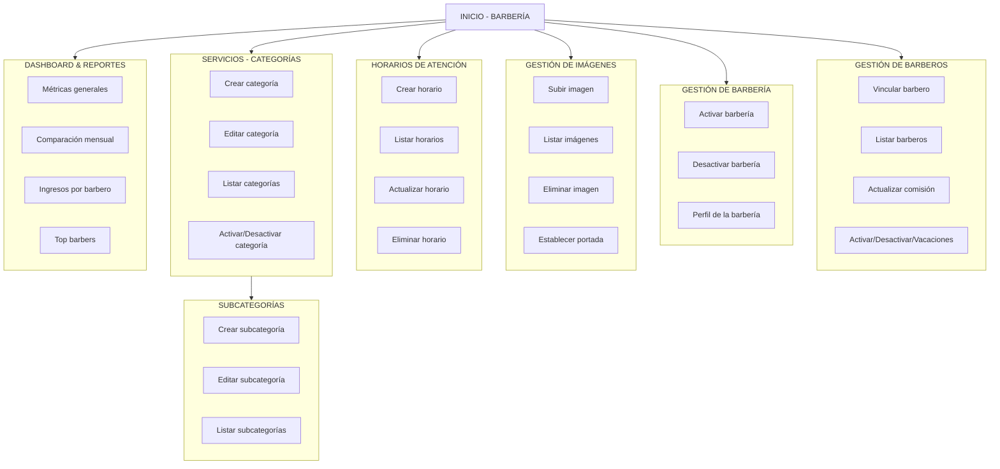

# Documentación General — Módulo Barbería
El módulo Barbería es el núcleo administrativo del sistema. Desde aquí, 
la barbería gestiona sus barberos, servicios, horarios, estado operativo, 
imágenes y reportes financieros.
Este módulo solo puede ser accedido por usuarios con el rol **BARBERIA**.

---

## 1. Perfil de la Barbería

Acciones:

- La barbería puede ver sus datos
- La barberia puede actualizar sus propios datos. 

---

## 2. Gestión de Barberos
La barbería puede vincular, listar, actualizar, activar/desactivar 
y gestionar el estado de los barberos bajo su administración.

### 2.1 Vincular barbero a la barbería
El barbero debe existir previamente como usuario con rol **BARBERO**.
La barbería lo vincula usando su correo electrónico.

#### Acciones:

- Crear vínculo entre barbero y barbería.
- Registrar su documento y comisión inicial.
- Validar que no pertenezca a otra barbería.
- Validar que el barbero exista

### 2.2 Listar barberos
Devuelve todos los barberos vinculados a la barbería actual.

#### Incluye:

- Datos personales
- Documento
- Comisión
- Estado (activo, desactivado, vacaciones)

### 2.3 Actualizar comisión de un barbero
Permite modificar el porcentaje de comisión.

### 2.4 Cambiar estado de un barbero

#### Tres estados posibles:

- Activo
- Desactivado
- Vacaciones (temporal, no disponible para citas)

Estas acciones no eliminan al barbero, solo modifican su disponibilidad operativa.

--- 

## 3. Estado de la Barbería
La barbería puede estar:

- Activa
- Inactiva

Cuando está inactiva, no puede recibir citas ni operar.

#### Estados cambiables manualmente:

`/activate`
`/desactivate`

---

## 4. Gestión de Imágenes (Galería de Barbería)
Límite: **5 imágenes por barbería**
Formatos aceptados: JPG, PNG
Validaciones de tamaño y peso.

### Funcionalidades:

- Subir imagen
- Listar imágenes
- Eliminar imagen
- Establecer una imagen como portada
(solo 1 imagen puede ser portada al mismo tiempo)

---

## 5. Horarios de Atención
Cada barbería debe registrar sus días y horarios de operación.

### Cada registro contiene:

- Día de la semana
- Hora de inicio
- Hora de fin

#### Funcionalidades:

- Crear horario
- Listar horarios
- Editar horario
- Eliminar horario

---

## 6. Gestión de Servicios (Categorías & Subcategorías)

### 5.1 Categorías
Una categoría representa un servicio general.
Ej:

- Corte
- Barba
- tinte

#### La barbería puede:

- Crear categoría
- Editar categoría
- Listar categorías
- Activar/desactivar categoría

### 5.2 Subcategorías
Cada categoría puede tener múltiples subcategorías, con:

- Nombre
- Descripción
- Precio
- Duración (minutos)

#### Acciones:

- Crear subcategoría
- Editar subcategoría
- Listar subcategorías

---

## 7. Seguridad
- Todas las rutas están protegidas con hasRole('BARBERIA')
- Validaciones de propiedad en todas las operaciones:
  - No se pueden manipular barberos de otra barbería 
  - No se pueden editar categorías ajenas
  - No se pueden gestionar horarios de otra barbería
  - No se pueden ver reportes de otra barbería

---

## 8. Dashboard de Barbería

El sistema genera un dashboard con métricas clave:

- Métricas principales:
- Ingresos totales
- Comisiones pagadas
- Propinas
- Total de transacciones
- Barberos activos

Reportes:

- Comparación mensual
- Reporte mensual por barbero
- Reporte semanal por barbero
- Reporte diario por barbero
- Ranking de barberos (Top barbers)

Toda la información proviene de la tabla de transacciones.

---

## 9. Diagrama de Flujo General del Módulo Barbería

