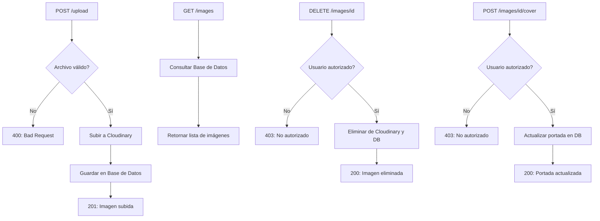

# Gestion de Images de Barberia
El módulo de gestión de imágenes permite que el dueño de una barbería:

- Suba imágenes a Cloudinary
- Liste las imágenes registradas
- Elimine imágenes
- Establezca una imagen como portada
- Tenga un máximo de 5 imágenes
- Conserve validaciones de tipo y tamaño

El sistema asocia automáticamente las imágenes con la barbería del usuario autenticado.

---
## Estructura General
```markdown
Controller/
    BarberShopImageController.java

Service/
    BarberShopImageService.java

Entity/
    BarberShop.java
    BarberShopImage.java

Repository/
    BarberShopImageRepository.java

config/
    CloudinaryConfig.java

```

## Diagrama de flujo


## Endpoints del módulo
### POST /images/upload
Sube una imagen a Cloudinary y la registra.
#### Reglas:
- Máximo 5 imágenes por barbería.
- Solo formatos permitidos: PNG, JPG, JPEG, WEBP.
- Tamaño máximo sugerido: 2MB.

#### Ejemplo POSTMAN

**Tipo:** Form-Data

**Key:** file (tipo file)

**Value:** seleccionar imagen

### GET /images
Lista todas las imágenes de la barbería del usuario autenticado.
#### Respuesta ejemplo:
```json
[
{
"id": 10,
"url": "https://res.cloudinary.com/...",
"publicId": "barberias/abc123",
"isCover": true
}
]
```

### DELETE /images/{id}
Elimina la imagen tanto de Cloudinary como de la base de datos.
#### Respuesta ejemplo:
```json
{ "message": "Imagen eliminada" }
```

## Reglas importantes
- Cada barbería puede tener máximo 5 imágenes.
- Solo una imagen puede estar marcada como portada.
- Las imágenes se guardan en Cloudinary para evitar ocupar espacio local.
- Los usuarios solo pueden gestionar imágenes pertenecientes a su barbería.
- Se realizan validaciones de tipo y tamaño antes de subir.