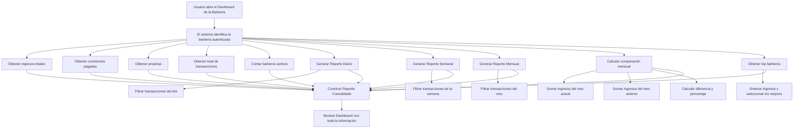

#  Documentación del Módulo de Transacciones y Reportes

Este módulo gestiona:

* Las **transacciones** realizadas en la barbería
* Los **reportes** estadísticos
* El **dashboard** general
* El registro de ingresos globales de la barbería mediante una tabla dedicada:
  **`barbershop_income`**

---

##  **Descripción General**

El módulo registra ingresos tanto a nivel de **barbero individual** (transacciones) como a nivel de **barbería completa** (tabla global).

De esta forma, el sistema puede generar estadísticas sin depender exclusivamente de las transacciones de cada barbero.

---

## **Tabla: IncomeBarbershop (barbershop_income)**

Esta tabla guarda el **ingreso total de la barbería por cada transacción finalizada**.

### ¿Por qué existe esta tabla?

Porque la barbería no siempre gana exactamente la “comisión del barbero”.
La barbería tiene su propio ingreso, registrado así:

* `barbershopIncome = transaction.amountPaid - barberCommission`

Cada vez que se realiza un pago, se registra un nuevo row en `barbershop_income`.

### ¿Para qué se usa?

Los reportes de la barbería (dashboard global) **NO dependen directamente de las transacciones individuales**, sino del acumulado real de la barbería registrado aquí.

Permite:

* Cálculo de ingresos reales
* Comparación entre meses
* Estadísticas globales sin recalcular a partir de comisiones

---

## **Transacciones**

Las transacciones siguen representando:

* Comisión del barbero
* Propina
* Fecha
* Barbero asociado

Y se usan para:

* Reportes por barbero
* Top barberos
* Rango de fechas
* Diario / semanal / mensual

---

##  **Reportes del Sistema**

Los reportes se dividen en dos niveles:

---

##  **Reportes por barbero** (basados en transacciones)

Incluyen:

#### Rango de fechas

#### Diario

#### Semanal

#### Mensual

#### Comparacion mes actual vs mes anterior

#### Ultimos 7 dias

Cada uno agrupa transacciones por barbero y calcula:

* Comisión total
* Propinas
* Total generado (comisión + propina)

---

##  **Reportes de la Barbería** (basados en barbershop_income)

Usan la tabla global de ingresos de la barbería.

Incluyen:

#### Total income real de la barbería

#### Comisiones totales pagadas

#### Propinas recibidas

#### Total transacciones

#### Barberos activos

#### Reporte diario

#### Reporte semanal

#### Reporte mensual

#### Comparación mensual

#### Top barberos

#### Dashboard completo

Estos datos se filtran siempre por la barbería autenticada.

---

