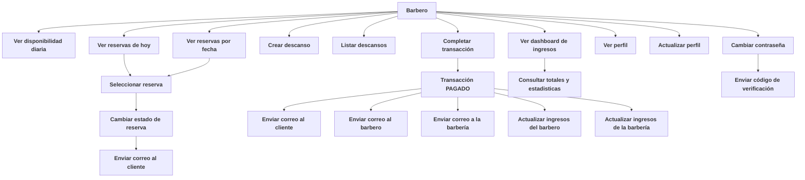

# Documentación General — Módulo Barbero
El barbero administra sus descansos, reservas diarias,
estados de reserva y pagos.

---

### 1. Ver su disponibilidad diaria
El barbero puede:

- Seleccionar fecha (o por defecto hoy)
- Ver todos sus bloques:
  - DISPONIBLE
  - OCUPADO
  - NO DISPONIBLE (fuera de horario)

---

### 2. Gestionar descansos (Breaks)
El barbero puede:

- Crear descanso
- Listar descansos por fecha
- Editar breaks exitentes

Los breaks afectan los bloques de disponibilidad.

---

### 3. Ver sus reservas
El barbero puede:

- Listar reservas del día
- Listar reservas por fecha

**Ver detalles:**
- Cliente
- Servicios
- Duración
- Estado actual

--- 

### 4. Cambiar estado de reserva
Estados disponibles que puede asignar:

- CONFIRMADA
- EN_CURSO
- COMPLETADA
- CANCELADA

#### Notificaciones enviadas:
**Correo al cliente:** cambio de estado de reserva

---

### 5. Completar transacciones
El barbero puede:

- Completar la transacción creada por el cliente
- Confirmar monto total
- Registrar propina
- Pasar estado a PAGADO

Esto actualiza ingresos para:
- Barbería
- Barbero

#### Notificaciones enviadas:
**Correo al cliente:** Confirmando que su pago fue exitoso
**Correo al barbero:** Confirmando que ha recibido un nuevo pago
**Correo al barberia:** Confirmando que se ha realizado una nueva transaccion

---

### 6. Perfil del Barbero
El barbero puede:

- Ver perfil
- Actualizar datos
- Cambiar contraseña
- Solicitar código de verificación

#### Notificación:
Correo con código para cambio de contraseña.

---

### 7.Dashboard de Ingresos del Barbero
El barbero dispone de un dashboard de ingresos, donde puede visualizar
el resumen económico generado por sus servicios.

#### Información disponible en el dashboard:

El barbero puede consultar:

- Total de ingresos generados diario, semanal y mensual
- Comparacion mes actual vs mes anterior
- Ingresos Ultimos 7 dias
- Horas trabajadas

---

### Diagrama de Flujo – Barbero

