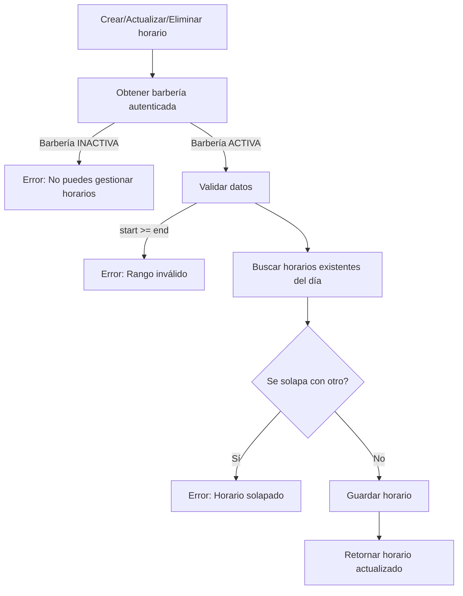

# Horarios de Atención de la Barbería
Este módulo permite al dueño de la barbería crear, listar, actualizar y eliminar horarios de atención para cada día de la semana.
Los horarios permiten indicar intervalos múltiples por día (ejemplo: 08:00–12:00 y 14:00–18:00).

También se incluye la lógica para calcular si la barbería está abierta o cerrada.

## Objetivos

- Permitir registrar múltiples rangos de horario para cada día.

- Validar que los horarios no se solapen.

- Evitar duplicados.

- Bloquear la gestión si la barbería está inactiva.

Mostrar en la búsqueda si la barbería está abierta / cerrada según el día y hora actual.

Enviar al cliente del buscador el horario del día correspondiente.

## Reglas del módulo
### Cada día puede tener múltiples horarios
Ejemplo para LUNES:
```markdown
08:00 - 12:00
14:00 - 18:00
```

### Los horarios no deben solaparse
Ejemplo inválido:
```markdown
08:00 - 12:00
11:00 - 13:00  -- No valido
```

### La barbería debe estar ACTIVA
Si está INACTIVA → se lanza excepción.

## Endpoints
### Crear horario
```markdown
POST /barbershop/opening-hours
```
Request:
```json
{
"dayOfWeek": "MONDAY",
"startTime": "09:00",
"endTime": "12:00"
}
```

### Listar horarios de mi barbería
```markdown
GET /barbershop/opening-hours
```
### Actualizar horario
```markdown
PUT /barbershop/opening-hours/{id}
```
### Eliminar horario
```markdown
DELETE /barbershop/opening-hours/{id}
```

## Respuesta del buscador
Ejemplo cuando el día tiene varios horarios:
```json
{
  "name": "Barbería Elegante",
  "address": "Calle 123 #45-67",
  "phone": "3006549871",
  "openNow": true,
  "todaySchedule": [
    "09:00 - 12:00",
    "14:00 - 18:00"
  ]
}

```

## Diagrama de flujo



