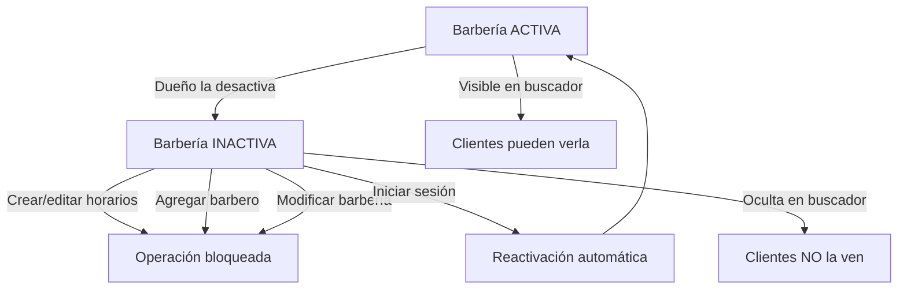

# Estado de la Barbería: ACTIVO e INACTIVO
El estado de una barbería determina qué funcionalidades están disponibles dentro del sistema. El campo se almacena en la base de datos como `status` dentro de la entidad `BarberShop`, con valores:

ACTIVO → La barbería funciona normalmente.

INACTIVO → La barbería está deshabilitada temporalmente y no puede gestionar operaciones internas.

## ¿Cuándo se usa el estado INACTIVO?
Una barbería pasa a estado INACTIVO cuando el dueño decide desactivarla manualmente. Esto puede servir para:

- Cerrar temporalmente el negocio.
- Suspender su actividad sin borrar datos.
- Evitar que aparezca en búsquedas mientras no esté operativa.

## Diagrama de flujo


## Restricciones cuando una barbería está INACTIVA
Si la barbería está en estado INACTIVO, se bloquean las siguientes acciones:

- Crear, actualizar o eliminar horarios.
- Agregar barberos.
- Editar información.
- Mostrar la barbería en búsquedas públicas.

Esto se valida con:
```jshelllanguage
  if (barberShop.getStatus() == BarberShopStatus.INACTIVO) {
        throw new BadRequestException("No puedes gestionar esta función mientras la barbería está inactiva.");
}
```
## Reactivación
La reactivación es manual: el dueño puede activar nuevamente su barbería desde el endpoint correspondiente.
```markdown 
PUT /barbershop/activate
```
Esto cambia el status a ACTIVO y todas las funcionalidades se habilitan nuevamente.

## Pruebas en Postman

### Desactivar barbería:

#### PUT /barbershop/desactivate
Debe responder: `Barberia desactivada`

### Intentar crear horario estando INACTIVO:

Debe responder error 400.

### Activar barbería nuevamente:

#### PUT /barbershop/activate

Debe responder: `Barberia activada`

### Volver a hacer operaciones normalmente:

Crear horarios, agregar barberos, etc.