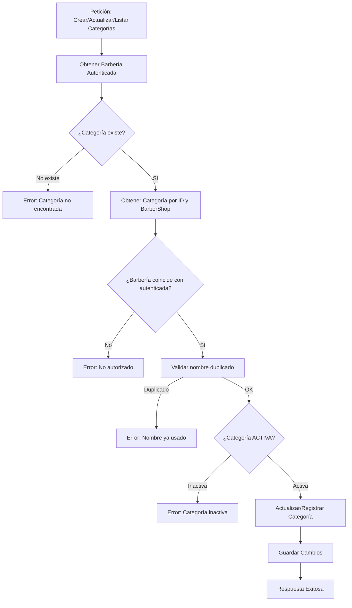
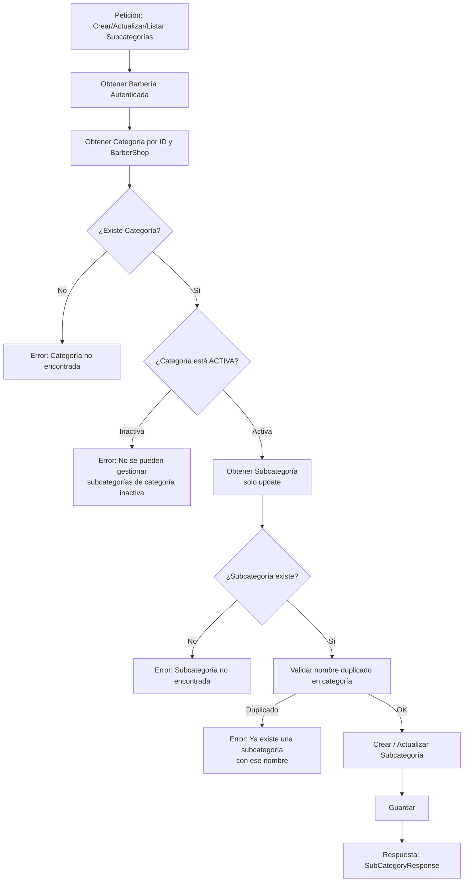

# Módulo de Categorías y Subcategorías
El módulo de Categorías y Subcategorías permite a cada barbería organizar sus servicios de manera jerárquica.
Una Categoría agrupa un conjunto de Subcategorías (servicios específicos).
Este módulo integra:

- Validaciones de negocio (estado activo/inactivo)
- Restricciones por barbería autenticada
- Actualizaciones controladas
- Reutilización de lógica de validación

## Categorías
1. Una categoría puede estar ACTIVA o INACTIVA
2. Si una categoría está INACTIVA:
   - NO se puede actualizar
   - NO se pueden gestionar subcategorías
3. No pueden existir categorías duplicadas por barbería.
4. Solo el dueño de la barbería autenticada puede administrarlas.

### Operaciones de Categorías
#### Crear Categoría
**POST /categories**

**Validaciones:**
- Nombre único dentro de la barbería.
- Status inicial por defecto: ACTIVO.

#### Actualizar Categoría

**PUT /categories/{categoryId}**

**Validaciones:**
- Verifica que la categoría pertenezca a la barbería autenticada.
- No permite actualizar si el estado es INACTIVO.
- Nombre único (excluyendo la misma categoría).

#### Activar/Desactivar Categoría

**PUT /categories/{categoryId}/status/activate o desactivate**

- Desactivar una categoría bloquea toda gestión de subcategorías.
- Activar la categoría la habilita nuevamente.

## SubCategorias
1. Las subcategorías siempre pertenecen a una categoría.
2. No se permiten subcategorías si la categoría está inactiva.
3. No pueden existir dos subcategorías con el mismo nombre dentro de una categoría.
4. Todas las operaciones se validan por barbería:
   - el usuario solo puede modificar subcategorías de su propia barbería.

### Operaciones de Subcategorías
#### Crear Subcategoría

**POST /categories/{categoryId}/subcategories**

**Validaciones:**
- Verifica que la categoría existe en la barbería del usuario.
- Verifica que la categoría esté activa.
- Nombre único dentro de la categoría.

#### Actualizar Subcategoría

**PUT /categories/{categoryId}/subcategories/{subCategoryId}**

**Flujo del servicio:**

- Obtener barbería del usuario.
- Obtener categoría por categoryId.
- Obtener subcategoría por subCategoryId y la categoría.
- Validar que la categoría esté activa.
- Validar nombre único excluyendo la propia subcategoría.

## Diagrama de flujo de Categorias

## Diagrama de Flujo Subcategorias

