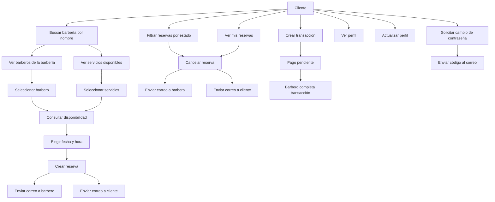

# Documentación General — Módulo Cliente
El cliente es el usuario final que realiza reservas, 
gestiona pagos, consulta disponibilidad y administra su perfil personal.

---

### 1. Buscar barbería por nombre
El cliente puede buscar barberías desde el dashboard mediante un campo de texto.

---

### 2. Ver barberos por barbería
Desde una barbería seleccionada, el cliente puede listar todos los barberos asociados.

---

### 3. Ver servicios disponibles en una barbería
El cliente puede ver servicios, subcategorías y precios.

--- 

### 4. Disponibilidad
El cliente puede consultar horarios disponibles de un barbero específico según:

- Fecha seleccionada
- Servicios seleccionados
- Duración total
- Bloques requeridos

**Flujo:**

- El cliente selecciona barbería.
- Elige barbero.
- Elige servicios.
- Selecciona fecha.

La API devuelve slots disponibles (DISPONIBLE / OCUPADO / NO DISPONIBLE).

---

### 5. Crear una reserva
El cliente puede:

- Seleccionar barbería
- Seleccionar barbero
- Seleccionar servicios
- Seleccionar fecha y hora disponible
- Confirmar reserva

#### Notificaciones enviadas:
- **Correo al cliente:** confirmación de reserva
- **Correo al barbero:** nueva reserva agendada

---

### 6. Ver sus Reservas
El cliente puede:

- Ver todas sus reservas

- Filtrar por estado:
  - CONFIRMADA
  - EN_CURSO
  - COMPLETADA
  - CANCELADA

---

### 7. Cancelar una reserva
El cliente puede cancelar una reserva mientras el barbero
no la haya marcado como COMPLETADA.

#### Notificaciones enviadas:
- **Correo al barbero:** cliente canceló la reserva
- **Correo al cliente:** confirmación de cancelación

---

### 8. Pagos / Transacciones
El cliente puede:

- Crear transacción
- Elegir método de pago
- Agregar propina
- Añadir notas

El pago queda en estado:

- PENDIENTE
- COMPLETADO (cuando barbero lo completa)

---

### 9. Perfil del Cliente
El cliente puede:

- Ver su perfil
- Actualizar datos personales
- Cambiar contraseña
- Solicitar código enviado al correo para validación

#### Notificación:
Se envía correo con código de verificación para cambio de contraseña.

---

### Diagrama de Flujo – Cliente

