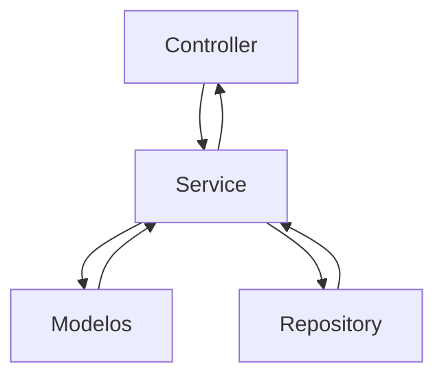
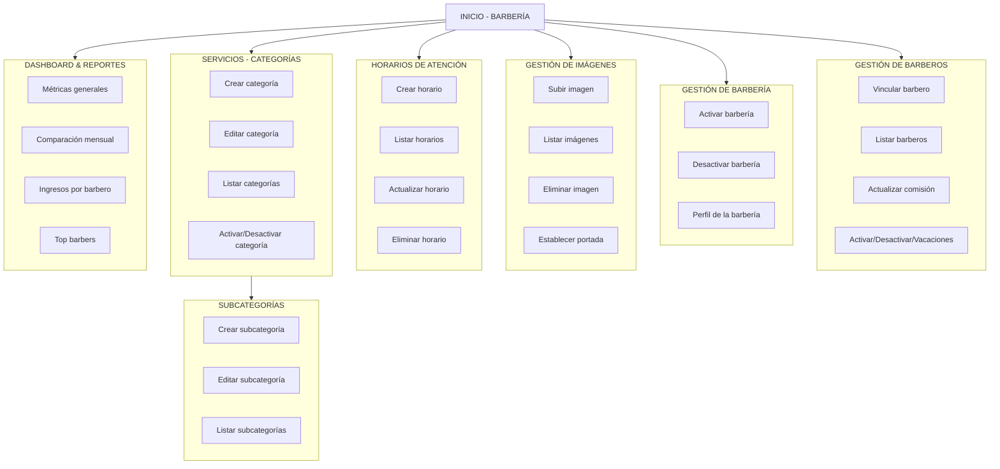
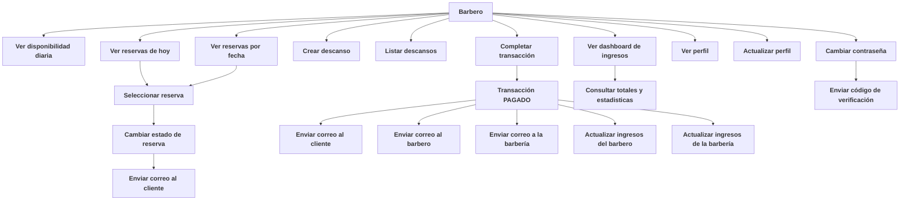
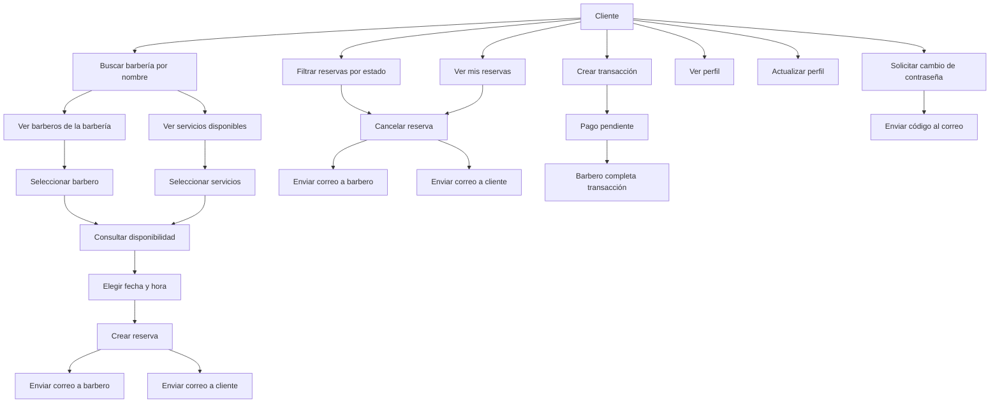

# DOCUMENTACIÓN GENERAL DEL SISTEMA
## Sistema de Gestión de Barberías

---

### 1. Descripción General
El sistema de gestión de barberías es una API REST diseñada para administrar de
forma integral el funcionamiento de una barbería, permitiendo la interacción
entre Clientes, Barberos y Barberías.

El sistema cubre:

- Gestión de reservas
- Disponibilidad de barberos
- Pagos y transacciones
- Gestión de ingresos
- Notificaciones automáticas por correo
- Administración de barberías y barberos

La API está diseñada con:

- Arquitectura por capas
- Control de acceso por roles
- Autenticación JWT (Bearer Token)
- Documentación mediante Swagger (OpenAPI con anotaciones)

---

### 2. Arquitectura General
El sistema está organizado por roles, cada uno con responsabilidades claramente definidas:

|    Rol   |                      Descripción                     |
|:--------:|:----------------------------------------------------:|
| Cliente  | Agenda citas, realiza pagos y gestiona su perfil     |
| Barbero  | Atiende reservas, gestiona disponibilidad e ingresos |
| Barbería | Administra barberos, servicios, horarios y métricas  |
| Sistema  | Gestiona correos, validaciones y reglas de negocio   |

---

### 3. Roles del Sistema
#### Cliente
Usuario final que consume los servicios de la barbería.
#### Barbero
Profesional que presta los servicios y gestiona su agenda y pagos.
#### Barbería
Entidad administrativa que controla barberos, servicios, horarios e ingresos.

---

### 4. Sistema de Notificaciones

El sistema envía correos automáticos en los siguientes eventos:

- Creación de reserva
- Cancelación de reserva
- Cambio de estado de una reserva
- Recordatorio de cita (20 minutos antes)
- Cambio / recuperación de contraseña (código de verificación)
- Transacción completada (cliente, barbero y barbería)

Estos correos tienen el objetivo de establecer comunicación efectiva entre las partes.

---

### 5. Transacciones y Pagos

El sistema maneja transacciones en dos fases:

1. Cliente crea la transacción
- Selecciona método de pago
- Agrega propina
- La transacción queda en estado PENDIENTE
2. Barbero completa la transacción
- Marca como PAGADO
- Se calculan ingresos
- Se envían correos
- Se actualizan dashboards

---

### 6. Dashboards
#### Dashboard del Cliente

- Historial de reservas
- Estado de reservas
- Información básica de pagos

#### Dashboard del Barbero

- Ingresos diarios, semanales, y mensuales
- Comparacion de mes actual vs anterior
- Ingresos de ultimos 7 dia

#### Dashboard de la Barbería

- Ingresos generales
- Comparación mensual
- Ingresos por barbero
- Ranking de barberos

---

### 7. Arquitectura por capas
La arquitectura está compuesta por las siguientes capas principales:
```scss
┌──────────────────────────────┐
│        Capa de Presentación  │
│        (Controllers / API)   │
└──────────────▲───────────────┘
               │
┌──────────────┴───────────────┐
│        Capa de Aplicación    │
│        (Services)            │
└──────────────▲───────────────┘
               │
┌──────────────┴───────────────┐
│        Capa de Dominio       │
│         (Entities)           │
└──────────────▲───────────────┘
               │
┌──────────────┴───────────────┐
│        Capa de Persistencia  │
│      (Repositories / DB)     │
└──────────────────────────────┘
```

#### Descripción de Cada Capa

##### Capa de Presentación (API / Controllers)

**Responsabilidad**
Gestiona las solicitudes HTTP y expone los endpoints REST de la aplicación.

**Características**
- No contiene lógica de negocio
- Valida datos de entrada (`@Valid`)
- Controla roles y permisos
- Maneja códigos de respuesta HTTP
- Documenta la API (Swagger)

**Componentes**
- Controllers REST
- DTOs (Request / Response)
- Anotaciones de seguridad (`@PreAuthorize`)

#### Capa de Aplicación (Services)

**Responsabilidad**
Contiene la lógica de negocio y coordina el flujo entre capas.

**Características**
- Orquesta operaciones complejas
- Aplica reglas del sistema
- Gestiona estados
- Lanza excepciones de negocio
- Coordina notificaciones

**Componentes**
- Validaciones de reglas
- Manejo de transacciones
- Comunicación entre módulos

#### Capa de Dominio (Entities)
**Responsabilidad**
Define el modelo de negocio y las reglas fundamentales del sistema.

**Características**
- Define estados y relaciones
- Centraliza reglas de negocio

**Componentes**
- Entidades
- Enums
- Reglas de negocio

#### Capa de Persistencia (Repositories)
**Responsabilidad**
Gestiona el acceso a datos y la comunicación con la base de datos.

**Características**
- Implementa repositorios
- No contiene lógica de negocio
- Mapea entidades a tablas
- Usa ORM (JPA/Hibernate)

**Componentes**
- Repositories
- Consultas JPQL / Criteria
- Mapeos entidad–tabla


#### Flujo




---

### 8. Diagramas de Flujo

#### Flujo General - Barberia


#### Flujo General - Barbero



#### Flujo General - Cliente



---

### 9. Documentación API

La API se documenta con Swagger UI mediante anotaciones OpenAPI.

Acceso: /swagger-ui.html

Autenticación vía botón Authorize (JWT)