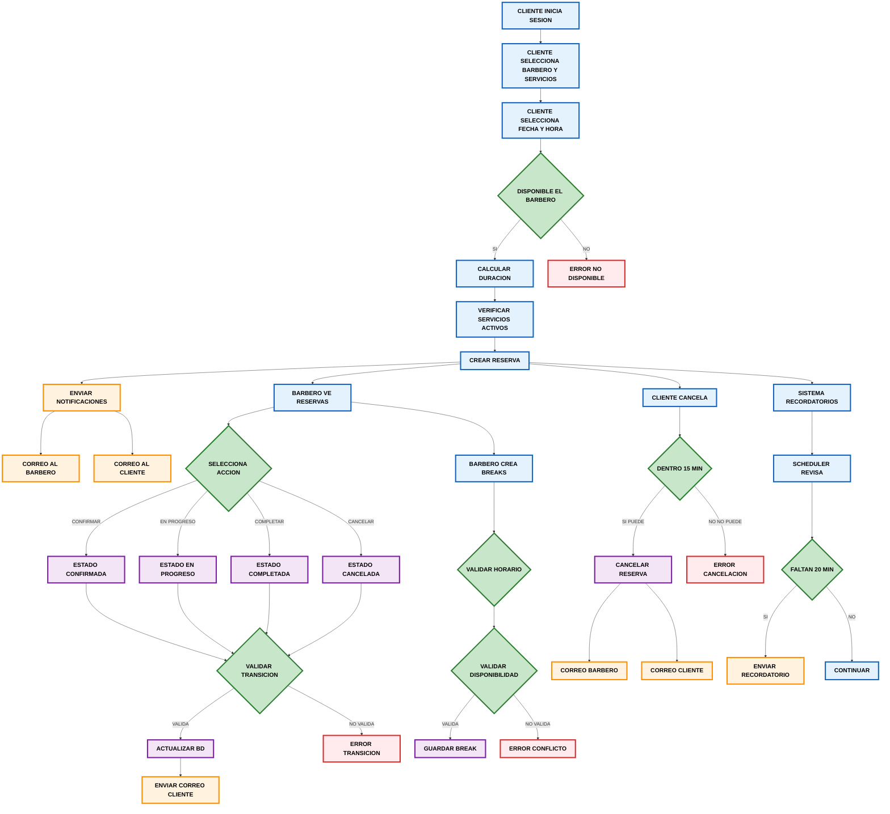

# Modulo de Reservas
Este módulo gestiona todo el proceso de creación, administración, disponibilidad, control y recordatorios de citas entre clientes y barberos.

---

## Funcionalidades Principales del modulo
El módulo de reservas implementa:

- Creación de citas
- Verificación de disponibilidad del barbero
- Gestión de breaks del barbero
- Panel de cliente (ver, filtrar, cancelar)
- Panel del barbero (ver, filtrar, actualizar estado)
- Notificaciones de:
  - recordatorio de cita
  - cambio de estado
  - reserva barbero 
  - confirmación de reserva cliente 
  - cancelar reserva.
- Control de estado de reservas
- Validaciones operativas (evitar solapamientos, restricciones de cancelación)

--- 

## Disponibilidad del barbero
El sistema calcula los horarios disponibles del barbero combinando:
### Horarios laborales
Todos los barberos cumplen el horario asignado diario de su barberia:
- Hora de inicio
- Hora de fin

### Reservas existentes
Si el barbero tiene una reserva a una hora, ese bloque se considera ocupado.

### Breaks del barbero
Los breaks del barbero también bloquean horario:
- Hora inicio
- Hora fin

### Duración del servicio
El cálculo se hace verificando que el slot tenga suficiente espacio para cubrir la duración del servicio.

---
### FLUJO
1. Obtener horario disponible del barbero
2. Excluir reservas existentes
3. Excluir breaks
4. Validar duración del servicio
5. Devolver lista de horas libres

---

## Creación de Reservas
Para crear una reserva se validan:

- Disponibilidad real del barbero
- Que no exista superposición con otra reserva
- Que no entre en conflicto con un break
- Que esté dentro del horario laboral
- Que la duración del servicio tenga espacio suficiente
- Si todo es correcto, se crea la cita con:

Estado inicial: **Pendiente**

---

## Estado de la Reserva

|   Estado   |           Descripción           |
|:----------:|:-------------------------------:|
| Pendiente  | Creada, sin acción adicional    |
| Confirmada | Aceptada                        |
| En proceso | El servicio ya inició           |
| Finalizada | El servicio terminó             |
| Cancelada  | Cancelada por cliente o barbero |

---

## Panel del Cliente
El cliente puede:

### Ver sus reservas
Puede consultar todas sus citas y filtrarlas por:
- Estado

### Cancelar una reserva
El cliente solo puede cancelar si:

- Faltan más de 15 minutos para la cita
- Si faltan 15 minutos o menos:
  - cancelación bloqueada.

Además:
- No puede cancelar reservas pasadas
- La cancelación libera la hora

---

## Panel del Barbero
El barbero puede gestionar sus propias reservas:

### Ver reservas
- Citas del día actual
- Citas por fecha
- Historial completo

### Cambiar estado de la reserva
Puede cambiar el estado a:
- En Curso
- Completada
- Cancelada

---

## Gestión de Breaks del Barbero
Los barberos pueden registrar descansos que bloquean su agenda.
Cada break contiene:
- Hora de inicio
- Hora fin

Los breaks afectan:
- Cálculo de disponibilidad
- Validación de creación de reservas

---

## Notificaciones
En el módulo de reservas se implementó un sistema completo de notificaciones por correo. 
La idea es que tanto los clientes como los barberos estén siempre al tanto del estado de cada
cita.

### Correo al barbero cuando se crea una reserva
Cada vez que un cliente agenda una cita, el barbero recibe un correo con:
- Quién lo reservó
- Qué servicios pidió
- Fecha y hora
- Precio total
- Datos para contacto

### Confirmación de reserva al cliente
Después de crear la reserva, el cliente recibe un correo de confirmación que incluye:

- Nombre del barbero
- Servicios que se realizarán
- Hora exacta
- Dirección de la barbería
- Precio total

### Notificación cuando cambia el estado de una reserva
Siempre que el barbero cambie el estado de la reserva (por ejemplo: confirmada, en curso, completada), el cliente recibe un correo avisándole el cambio.

El correo incluye:

- Estado anterior
- Nuevo estado
- Detalles de la cita

### Recordatorio 20 minutos antes de la cita
El sistema revisa automáticamente las reservas cada minuto y, si falta aproximadamente 20 minutos para que empiece una cita, se envía un recordatorio al cliente.

El recordatorio le muestra:

- Qué servicios tiene agendados
- Nombre del barbero
- Hora de inicio
- Datos de la barbería

### Notificaciones cuando se cancela una reserva
Cuando una reserva es cancelada:
- El cliente recibe un correo confirmando que su cancelación fue procesada.
- El barbero también recibe un aviso, para ajustar su agenda.

---

## Validaciones Importantes
- Un cliente no puede reservar dos citas que se solapen
- Un barbero no puede recibir dos reservas al mismo tiempo
- Las reservas no pueden estar fuera del horario laboral
- Si un horario entra dentro de un break, no está disponible
- El cliente no puede cancelar si faltan ≤ 15 minutos
- No se permite cancelar reservas pasadas

---

## Seguridad y Restricciones por Rol
### Cliente:
- Solo gestiona sus propias reservas
- Puede filtrarlas
- Puede cancelarlas (si faltan > 15 min)

### Barbero:
- Solo ve sus propias reservas
- Puede cambiar estado
- Puede agregar breaks
- Puede ver por fecha o día actual

---

## Flujo General del Modulo

### Descripcion del Flujo
1. Cliente selecciona barbero y servicios:
   - valida disponibilidad 
   - reserva creada  
   - notificaciones enviadas.

2. Barbero puede ver sus reservas:
   - por fecha
   - día actual 
   - cambiar estado. 
Los cambios de estado disparan correos.

3. Cliente puede cancelar su reserva 
  - si no está en los últimos 15 minutos 
  - notificaciones tanto para él como para el barbero.

4. Breaks del barbero
  - se crean respetando horario laboral y bloques disponibles.

5. Recordatorios se envían automáticamente 20 minutos antes de la cita.

6. Errores y validaciones manejan disponibilidad, transiciones inválidas y cancelaciones no permitidas.

